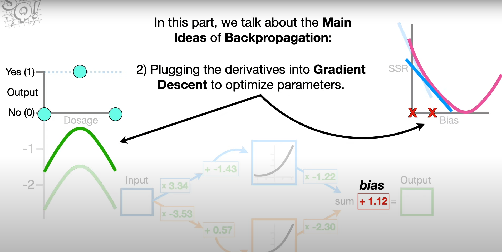
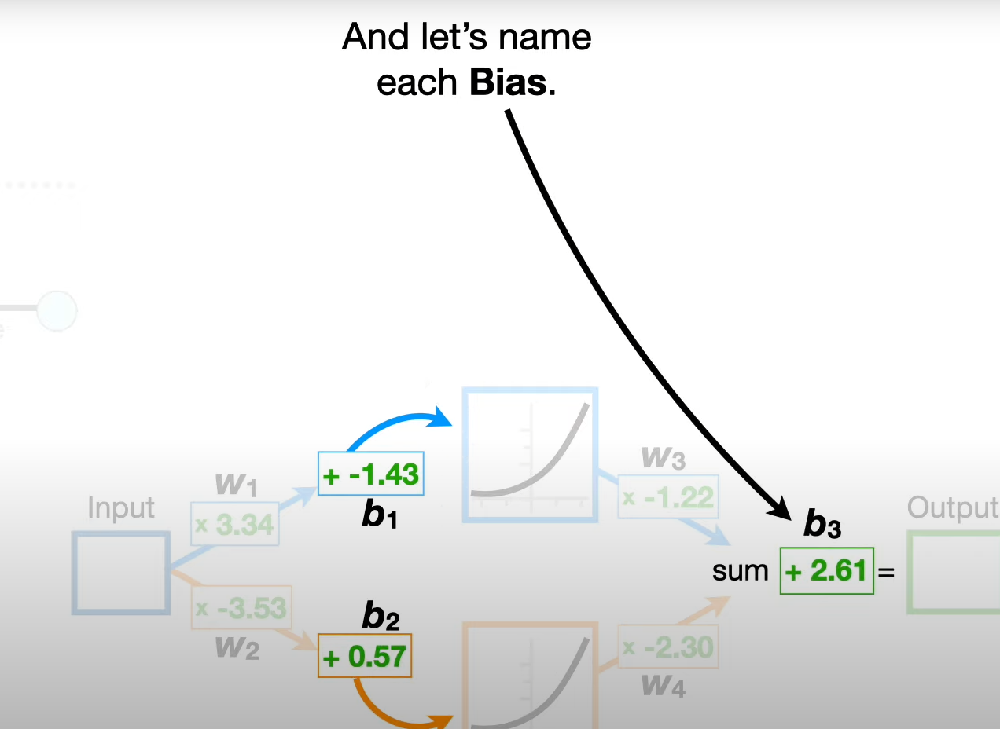
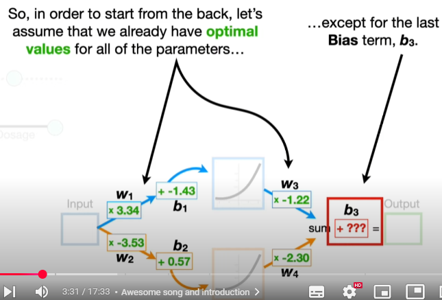
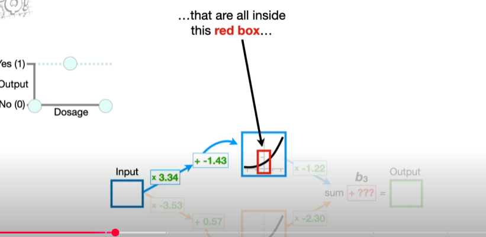
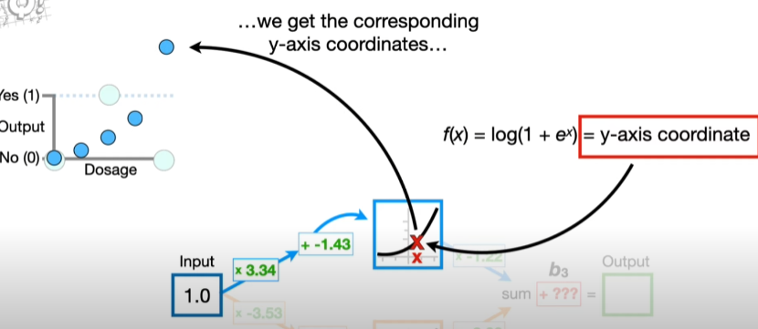
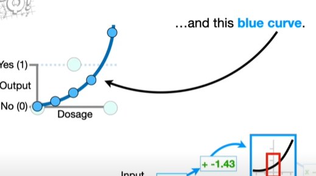
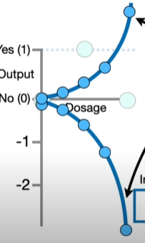
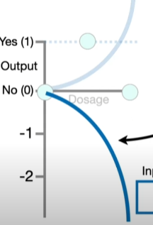

# Backpropagation Main Ideas

* It optimizes the **Weights** and **Biases** in Neural Networks.
* 
* 
* 
* Let's name weights ($w_1$, $w_2$, $w_3$ and $w_4$) and biases ($b_1$, $b_2$ and $b_3$).
* Backpropagation works with the last parameter and works its way backwards to estimate all of the other parameters.
* However, we can discuss main idea by estimating last parameter , bias $b_3$.
* 
> Note : Unoptimized Doses and Optimized Doses
* Now if we run Dosages from 0 to 1 through the connection to the top Node in the Hidden Layer, then we get the x-axis coordinates for the Activation Function  and when we plug the x-axis coordinates into the Activation Function (in this case is Softplus Activation Function i.e., ${f(x) = log(1 + e^x)}$)  
* Then we multiply the y-axis coordinates on the blue curve by -1.22  and then we get the final blue curve. 
* Now if we run Dosages from 0 to 1 through the connection to the bottom Node in the Hidden Layer, ... and then we get the final orange curve. 
* Adding those blue and orange curves will get us a green squiggle 
* Since we don't have optimal value of $b_3$, we gotta give it some initial value like $0$.
* $0$ means green squiggle doesn't move and it is far from observed values. 
* It can be quantified how good it fits the data by calculating $Sum$ $of$  $Squared$ $Residuals$ $=$ $\sum_{i=1}^{n} {(Observed_i - Predicted_i)^2}$.

> Note : Changing Bias means Squiggle translates

| Bias | Sum of Squared Residuals |
|------|--------------------------|
|  0   |           20.4           |
|  1   |            7.8           |
|  2   |           1.11           |
|  3   |           0.46           |

* Now, since $Sum$ $of$ $Squared$ $Residuals$ $=$ $\sum_{i=1}^{n} {(Observed_i - Predicted_i)^2}$, and each $$Predicted$$ value comes from $green$ $squiggle_i$, which comes from last part of neural network.
* Therefore, $green$ $squiggle_i$ $=$ $blue$ $+$ $orange$ $+$ $b_3$ .
* For Gradient Descent to optimize $b_3$, we need to take SSR's derivative $w.r.t$ $b_3$.
> > > # $\frac{d \, SSR}{d \, b_3}$
* Therefore by **The Chain Rule**,
* # $\frac{d \, SSR}{d \, b_3}$  $=$ $\frac{d \, SSR}{d \, Predicted}$ $\times$ $\frac{d \, Predicted}{d \, b_3}$
    1. # $\frac{d \, SSR}{d \, Predicted} = -2 \times \sum_{i=1}^{n} {(Observed_i - Predicted_i)}$
    2. # $\frac{d \, Predicted}{d \, b_3} = 1$
    3. # $\frac{d \, SSR}{d \, b_3} = -2 \times \sum_{i=1}^{n} {(Observed_i - Predicted_i)}$

> > Note : Let Learning Rate be $0.1$
 
| Bias |$\frac{d \, SSR}{d \, b_3}$|Step Size = $\frac{d \, SSR}{d \, b_3} \times \text{Learning Rate}$|$ \text{New } b_3 = \text{Old } b_3 - \text{Step Size}$|
|------|---------------------------|-------------------------------------------------------------------|-----------------------------------------------------|
|  0   |           -15.7           |                   $-15.7 \times 0.1 = -1.57$                      |                1.57                                 |
|  1.57   |           -6.26           |                   $-6.26 \times 0.1 = -0.626$                      |                2.19                                 |

Do it till Step Size close to 0.

* Most optimized $b_3 = 2.61.$